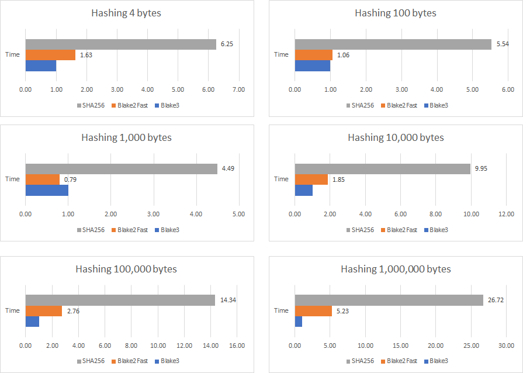
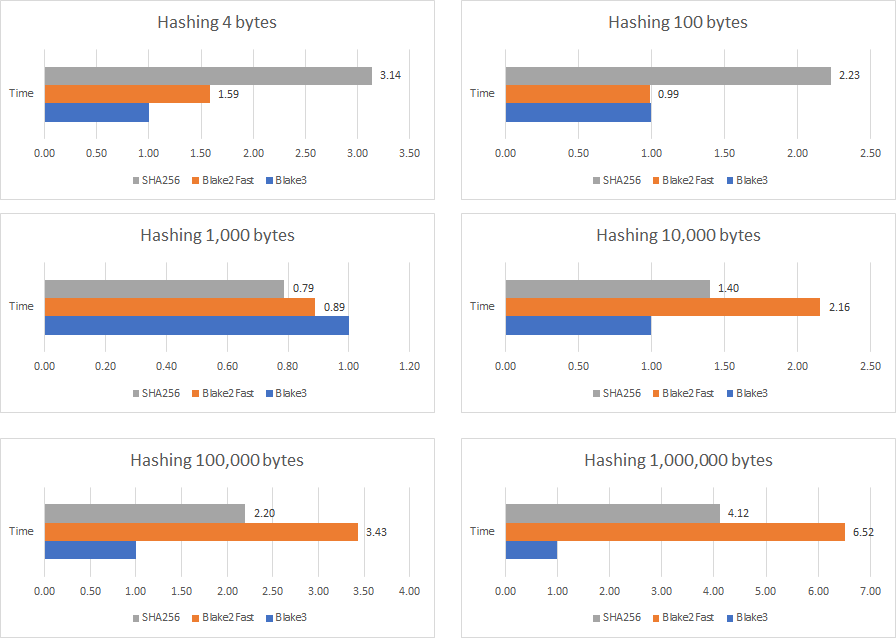

# Blake3<font color="A80016">.NET</span> [](https://github.com/xoofx/Blake3.NET/actions/workflows/managed.yml) [](https://github.com/xoofx/Blake3.NET/actions/workflows/native.yml) [](https://www.nuget.org/packages/Blake3/)


Blake3.NET is a fast managed wrapper around the SIMD Rust implementations of the [BLAKE3](https://github.com/BLAKE3-team/BLAKE3) cryptographic hash function.

> The current _native_ version of BLAKE3 used by Blake3.NET is `1.8.2`

## Features

- Compatible with .NET8.0+.
- Fast interop with `Span` friendly API.
- API similar to the [Blake3 Rust API](https://docs.rs/blake3/1.4.1/blake3/).
- CPU SIMD Hardware accelerated with dynamic CPU feature detection.
  - Multiple [platforms](#platforms) supported.
- Incremental update API via `Hasher`.
- Support for multi-threading hashing via `Hasher.UpdateWithJoin`.

## Usage

Hash a buffer directly:

```c#
var hash = Blake3.Hasher.Hash(Encoding.UTF8.GetBytes("BLAKE3"));
Console.WriteLine(hash);
// Prints f890484173e516bfd935ef3d22b912dc9738de38743993cfedf2c9473b3216a4
```

Or use the `Hasher` struct for incremental updates:

```c#
// Hasher is a disposable struct!
using var hasher = Blake3.Hasher.New();
hasher.Update(Encoding.UTF8.GetBytes("BLAKE3"));
var hash = hasher.Finalize();
```

Or seek in the output "stream" to any position:

```c#
using var hasher = Blake3.Hasher.New();
hasher.Update(Encoding.UTF8.GetBytes("BLAKE3"));
var hashAtPosition = new byte[1024];
var hash = hasher.Finalize(4242, hashAtPosition);
```

Or hash a stream on the go with `Blake3Stream`:

```c#
using var blake3Stream = new Blake3Stream(new MemoryStream());
blake3Stream.Write(Encoding.UTF8.GetBytes("BLAKE3"));
var hash = blake3Stream.ComputeHash();
```

Or produce a message authentication code using a 256-bit key:

```c#
using var blake3 = Hasher.NewKeyed(macKey);
blake3.UpdateWithJoin(message);
var tag = blake3.Finalize();
byte[] authenticationTag = tag.AsSpan().ToArray();
````

Or derive a subkey from a master key:

```c#
const string context = "[application] [commit timestamp] [purpose]";
using var blake3 = Hasher.NewDeriveKey(Encoding.UTF8.GetBytes(context));
blake3.Update(inputKeyingMaterial);
var derivedKey = blake3.Finalize();
byte[] subkey = derivedKey.AsSpan().ToArray();
```

## Platforms

Blake3.NET is supported on the following platforms:

- `win-x64`, `win-x86`, `win-arm64`, `win-arm`
- `linux-x64`, `linux-arm64`, `linux-arm`, `linux-musl-x64`, `linux-musl-arm64`
- `osx-x64`, `osx-arm64`

## Benchmarks

The benchmarks are running with [BenchmarkDotNet](https://github.com/dotnet/BenchmarkDotNet/) .NET 5.0 and done on multiple different sizes compared with the following implementations:

- Blake3.NET (Blake3 Native Version: `0.3.7`)
- [Blake2Fast](https://github.com/saucecontrol/Blake2Fast) `2.0.0`
- `System.Security.Cryptography.SHA256` of .NET 5.0

For the 1,000,000 bytes test, Blake3 is using the multi-threading version provided by Blake3 (`Hasher.UpdateWithJoin` method).

> **Results**
>
> - In general, Blake3 is much faster than SHA256 which is depending on whether your CPU supports Intel SHA Extensions.
>   - Blake3 can be from **2x to 10x times faster** than SHA256
> - The multi-threading version can give a significant boost if the data to hash is big enough
> - Blake3 is usually working best on large input.

## Results

The CPU before Intel Ice Lake or AMD Zen don't have the [Intel SHA CPU extensions](https://en.wikipedia.org/wiki/Intel_SHA_extensions).

In that case, **Blake3 is around 5x to 10x times faster** than the built-in SHA256.

The following benchmark was ran on an Intel Core i7-4980HQ CPU 2.80GHz (Haswell):



``` ini

BenchmarkDotNet=v0.12.1, OS=Windows 10.0.18363.1139 (1909/November2018Update/19H2)
Intel Core i7-4980HQ CPU 2.80GHz (Haswell), 1 CPU, 8 logical and 4 physical cores
.NET Core SDK=5.0.100
  [Host]     : .NET Core 5.0 (CoreCLR 5.0.20.51904, CoreFX 5.0.20.51904), X64 RyuJIT
  DefaultJob : .NET Core 5.0.0 (CoreCLR 5.0.20.51904, CoreFX 5.0.20.51904), X64 RyuJIT

```
|     Method |       N |            Mean |         Error |        StdDev |          Median |
|----------- |-------- |----------------:|--------------:|--------------:|----------------:|
|     **Blake3** |       **4** |        **85.06 ns** |      **1.704 ns** |      **2.154 ns** |        **83.55 ns** |
| Blake2Fast |       4 |       138.30 ns |      0.755 ns |      0.670 ns |       138.36 ns |
|     SHA256 |       4 |       531.82 ns |      0.842 ns |      0.788 ns |       531.85 ns |
|     **Blake3** |     **100** |       **145.12 ns** |      **2.899 ns** |      **4.064 ns** |       **142.56 ns** |
| Blake2Fast |     100 |       153.41 ns |      3.057 ns |      4.760 ns |       150.66 ns |
|     SHA256 |     100 |       803.32 ns |     11.420 ns |      8.916 ns |       797.37 ns |
|     **Blake3** |    **1000** |       **999.01 ns** |     **19.658 ns** |     **26.908 ns** |       **984.60 ns** |
| Blake2Fast |    1000 |       789.41 ns |     15.814 ns |     18.825 ns |       784.82 ns |
|     SHA256 |    1000 |     4,489.81 ns |     84.032 ns |     78.603 ns |     4,525.27 ns |
|     **Blake3** |   **10000** |     **4,099.92 ns** |     **49.985 ns** |     **46.756 ns** |     **4,121.94 ns** |
| Blake2Fast |   10000 |     7,593.55 ns |    127.193 ns |    112.753 ns |     7,609.07 ns |
|     SHA256 |   10000 |    40,799.82 ns |    769.102 ns |  1,386.850 ns |    41,460.32 ns |
|     **Blake3** |  **100000** |    **28,491.58 ns** |    **394.692 ns** |    **369.195 ns** |    **28,498.05 ns** |
| Blake2Fast |  100000 |    78,732.84 ns |    648.124 ns |    606.255 ns |    78,887.56 ns |
|     SHA256 |  100000 |   408,581.45 ns |  2,359.416 ns |  2,207.000 ns |   409,059.91 ns |
|     **Blake3** | **1000000** |   **138,481.22 ns** |  **1,300.797 ns** |  **1,216.767 ns** |   **138,460.16 ns** |
| Blake2Fast | 1000000 |   724,092.30 ns |  6,995.547 ns |  6,543.639 ns |   720,115.33 ns |
|     SHA256 | 1000000 | 3,699,812.03 ns | 37,739.460 ns | 35,301.514 ns | 3,678,276.17 ns |

## Results with SHA CPU extensions

If your CPU has [Intel SHA CPU extensions](https://en.wikipedia.org/wiki/Intel_SHA_extensions), then **Blake3 is on average ~2x times faster** than SHA256.

The following benchmarks was ran on a AMD Ryzen 9 3900X:



``` ini

BenchmarkDotNet=v0.12.1, OS=Windows 10.0.19041.630 (2004/?/20H1)
AMD Ryzen 9 3900X, 1 CPU, 24 logical and 12 physical cores
.NET Core SDK=5.0.100
  [Host]     : .NET Core 5.0 (CoreCLR 5.0.20.51904, CoreFX 5.0.20.51904), X64 RyuJIT
  DefaultJob : .NET Core 5.0.0 (CoreCLR 5.0.20.51904, CoreFX 5.0.20.51904), X64 RyuJIT


```
|     Method |       N |          Mean |        Error |       StdDev |
|----------- |-------- |--------------:|-------------:|-------------:|
|     **Blake3** |       **4** |      **77.86 ns** |     **0.332 ns** |     **0.310 ns** |
| Blake2Fast |       4 |     123.57 ns |     0.939 ns |     0.879 ns |
|     SHA256 |       4 |     244.31 ns |     1.157 ns |     1.082 ns |
|     **Blake3** |     **100** |     **125.60 ns** |     **0.497 ns** |     **0.440 ns** |
| Blake2Fast |     100 |     124.48 ns |     1.053 ns |     0.985 ns |
|     SHA256 |     100 |     279.82 ns |     1.853 ns |     1.734 ns |
|     **Blake3** |    **1000** |     **888.90 ns** |     **0.873 ns** |     **0.681 ns** |
| Blake2Fast |    1000 |     790.85 ns |     4.364 ns |     3.645 ns |
|     SHA256 |    1000 |     700.81 ns |     2.078 ns |     1.842 ns |
|     **Blake3** |   **10000** |   **3,508.37 ns** |    **23.411 ns** |    **21.899 ns** |
| Blake2Fast |   10000 |   7,569.91 ns |    40.661 ns |    38.034 ns |
|     SHA256 |   10000 |   4,922.90 ns |    14.360 ns |    13.432 ns |
|     **Blake3** |  **100000** |  **22,109.48 ns** |    **47.699 ns** |    **39.830 ns** |
| Blake2Fast |  100000 |  75,937.97 ns |   223.972 ns |   209.503 ns |
|     SHA256 |  100000 |  48,655.78 ns |   102.273 ns |    95.666 ns |
|     **Blake3** | **1000000** | **117,936.94 ns** |   **263.454 ns** |   **246.435 ns** |
| Blake2Fast | 1000000 | 768,752.03 ns | 1,836.783 ns | 1,718.128 ns |
|     SHA256 | 1000000 | 485,944.26 ns | 1,326.657 ns | 1,240.956 ns |

## How to Build?

You need to install the [.NET 10 SDK](https://dotnet.microsoft.com/download/dotnet/10.0) or latest Visual Studio 2026. Then from the root folder:

```console
$ dotnet build src -c Release
```

In order to rebuild the native binaries, you need to run the build scripts from [lib/blake3_dotnet](lib/blake3_dotnet/readme.md)

## License

This software is released under the [BSD-Clause 2 license](https://opensource.org/licenses/BSD-2-Clause).

## Author

Alexandre Mutel aka [xoofx](https://xoofx.github.io).
