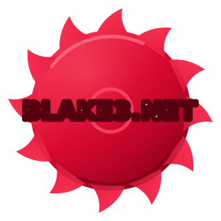

# Blake3.NET [](https://github.com/xoofx/Blake3.NET/actions/workflows/managed.yml) [](https://github.com/xoofx/Blake3.NET/actions/workflows/native.yml) [](https://www.nuget.org/packages/Blake3/) [](https://www.nuget.org/packages/Blake3.Native/)



Blake3.NET provides two fast, SIMD-accelerated implementations of the
[BLAKE3](https://github.com/BLAKE3-team/BLAKE3) cryptographic hash function: the fully managed
`Blake3` package and the native `Blake3.Native` package, which wraps the official Rust implementation.

> [!IMPORTANT]
> **Breaking change in 3.0:** In versions 2.x and earlier, the `Blake3` package uses the native Rust
> implementation. Starting with 3.0, `Blake3` is fully managed. To keep using the native implementation
> when upgrading, replace the `Blake3` package reference with `Blake3.Native`. Both packages retain the
> `Blake3` namespace and the same public API, so this package-reference change should not require source
> changes.

> The version of the native BLAKE3 implementation used by `Blake3.Native` is `1.8.2`.

## Features

- Compatible with .NET 10.
- `Span`-friendly API with either a fully managed or native implementation.
- API similar to the [Blake3 Rust API](https://docs.rs/blake3/1.4.1/blake3/).
- CPU SIMD Hardware accelerated with dynamic CPU feature detection.
  - Multiple [platforms](#platforms) supported.
- Incremental update API via `Hasher`.
- Fully managed regular, keyed, derive-key, incremental, and XOF hashing in the `Blake3` package.
- Support for multi-threaded hashing via `Hasher.UpdateWithJoin` in both `Blake3` and `Blake3.Native`.

## Packages

Starting with version 3.0, choose one of the two packages. Both expose the same hashing API and type
names in the `Blake3` namespace, including `Blake3.Hasher`, `Blake3.Hash`, `Blake3HashAlgorithm`, and
`Blake3Stream`:

```console
dotnet add package Blake3
# or, to use the Rust implementation through native interop:
dotnet add package Blake3.Native
```

The `Blake3` package uses runtime-selected scalar and 128/256/512-bit SIMD code implemented
entirely in .NET and has no native library dependency. `Blake3.Native` uses the optimized Rust
implementation through native interop. Switching packages does not require source changes. A project
should reference only one package because both intentionally define the same fully qualified public types.

## Usage

Hash a buffer directly:

```c#
var hash = Blake3.Hasher.Hash(Encoding.UTF8.GetBytes("BLAKE3"));
Console.WriteLine(hash);
// Prints f890484173e516bfd935ef3d22b912dc9738de38743993cfedf2c9473b3216a4
```

Or use the disposable `Hasher` type for incremental updates:

```c#
using var hasher = Blake3.Hasher.New();
hasher.Update(Encoding.UTF8.GetBytes("BLAKE3"));
var hash = hasher.Finalize();
```

With either package, `Hasher.UpdateWithJoin` hashes large aligned subtrees in parallel and preserves
the exact incremental semantics of `Update`; smaller inputs stay on the serial path to avoid scheduling
overhead.

Or seek in the output "stream" to any position:

```c#
using var hasher = Blake3.Hasher.New();
hasher.Update(Encoding.UTF8.GetBytes("BLAKE3"));
var hashAtPosition = new byte[1024];
hasher.Finalize(4242, hashAtPosition);
```

Or hash a stream on the go with `Blake3Stream`:

```c#
using var blake3Stream = new Blake3Stream(new MemoryStream());
blake3Stream.Write(Encoding.UTF8.GetBytes("BLAKE3"));
var hash = blake3Stream.ComputeHash();
```

Or produce a message authentication code using a 256-bit key:

```c#
using var blake3 = Hasher.NewKeyed(macKey);
blake3.UpdateWithJoin(message);
var tag = blake3.Finalize();
byte[] authenticationTag = tag.AsSpan().ToArray();
````

Or derive a subkey from a master key:

```c#
const string context = "[application] [commit timestamp] [purpose]";
using var blake3 = Hasher.NewDeriveKey(Encoding.UTF8.GetBytes(context));
blake3.Update(inputKeyingMaterial);
var derivedKey = blake3.Finalize();
byte[] subkey = derivedKey.AsSpan().ToArray();
```

## Platforms

The `Blake3.Native` package is supported on the following platforms:

- `win-x64`, `win-x86`, `win-arm64`
- `linux-x64`, `linux-arm64`, `linux-arm`, `linux-musl-x64`, `linux-musl-arm64`
- `osx-x64`, `osx-arm64`

The `Blake3` package has no native runtime dependency and can run on any platform supported by
.NET 10. Hardware intrinsics are selected at runtime, with a scalar fallback when SIMD is unavailable.

## Benchmarks

Starting with version 3.0, the `Blake3` package delivers near-native BLAKE3 performance without
shipping or loading a native library. Benchmarks on an AMD Ryzen 9 9950X (x64) and an Apple M4 Pro
(ARM64) show that:

- Serial `Blake3` performance ranges from about **10% faster to 35% slower** than the
  SIMD-optimized native Rust implementation across inputs from 4 bytes to 10 MB.
- On ARM64 it stays within **4%** of native performance at 4 bytes and is about **15% to 20% slower**
  from 1 KB to 10 MB; on x64 it is 9% faster at 100 bytes and is **12% to 35% slower** from 1 KB to 10 MB.
- `Hasher.UpdateWithJoin` substantially improves throughput for large inputs on both architectures,
  while the serial path avoids parallel scheduling overhead for smaller inputs.
- The serial `Blake3` and `Blake3.Native` paths perform these benchmarks without managed allocations.

See the [full benchmark methodology and results](doc/benchmarks.md) for the x64 and ARM64
environments, detailed measurements, and parallel crossover guidance.

## How to Build?

You need to install the [.NET 10 SDK](https://dotnet.microsoft.com/download/dotnet/10.0) or latest Visual Studio 2026. Then from the root folder:

```console
$ dotnet build src -c Release
```

In order to rebuild the native binaries, you need to run the build scripts from [lib/blake3_dotnet](lib/blake3_dotnet/readme.md)

## License

This software is released under the [BSD-Clause 2 license](https://opensource.org/licenses/BSD-2-Clause).

## Author

Alexandre Mutel aka [xoofx](https://xoofx.github.io).
